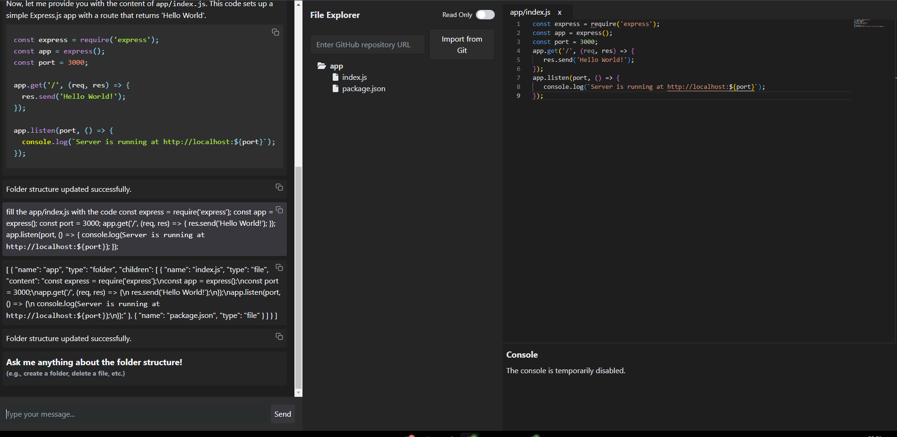

# Project Title: **Code Explorer App**

This project provides an interactive **Code Explorer App** that allows users to explore files, edit code, view console logs, and chat with a chatbot that can assist with managing the file structure. It’s built using **React** and uses components like **FileExplorer**, **CodeEditor**, **Console**, and **Chatbot**.

## Table of Contents

-   [Demo](#demo)
-   [Features](#features)
-   [Requirements](#requirements)
-   [Installation](#installation)
-   [Usage](#usage)
-   [Folder Structure](#folder-structure)
-   [Screenshots](#screenshots)
-   [Technologies Used](#technologies-used)
-   [Contributing](#contributing)
-   [License](#license)

## Demo

To see a brief demo of the app, watch the example video here: [exemple/2024-11-07 23-40-02.mp4](./exemple/2024-11-07%2023-40-02.mp4)

## Features

-   **File Explorer**: Visualize file and folder structures and interact with files and folders. Import repositories from GitHub by providing a repository URL.
-   **Code Editor**: Edit code with syntax highlighting and language support through **Monaco Editor**.
-   **Console**: Displays logs and messages from the app, with the option to interact programmatically in the future.
-   **Chatbot**: An AI-driven chatbot powered by **Ollama** that manages file operations based on user instructions. It can add, edit, and delete files or folders and return a JSON format of the updated structure.

## Requirements

This app requires **Ollama** to run the chatbot functionality. Please follow these steps to install and configure **Ollama**:

1. **Install Ollama**:

    - Download the **Ollama** application for your operating system from [https://ollama.com/download](https://ollama.com/download) and follow the installation instructions.

2. **Setup Ollama**:

    - Once installed, you may need to authenticate and set up **Ollama** according to your project requirements.

3. **Run Ollama in Browser**:
    - This project uses the **browser** version of Ollama. Ensure the `ollama/browser` package is installed and configured properly in the app. The chatbot will use **Ollama's Mistral model** for processing.

## Installation

1. **Clone the Repository**:

    ```bash
    git clone https://github.com/ernivani/ai-code-with-me.git
    cd code-explorer-app
    ```

2. **Install Dependencies**:

    ```bash
    npm install
    ```

3. **Run the App**:
    ```bash
    npm start
    ```

## Usage

1. **Import GitHub Repositories**: Enter a GitHub repository URL to import its file structure into the app.
2. **Explore Files**: Navigate the files and folders in the left-hand **File Explorer**.
3. **Edit Files**: Click on a file to open it in the **Code Editor**. Make edits as needed.
4. **Console**: View the console logs at the bottom of the app.
5. **Chatbot**: Type commands or queries to interact with the file system programmatically. The chatbot can manage file operations and respond with an updated file structure.

## Folder Structure

The application’s main components are:

-   **App.js**: Main application component.
-   **FileExplorer**: Manages file navigation, selection, and GitHub repository imports.
-   **CodeEditor**: Handles file editing with syntax highlighting.
-   **Console**: Displays app logs and feedback.
-   **Chatbot**: Responds to user queries and manages the file structure based on AI responses, using **Ollama**.

## Screenshots

### Example Screenshot

Below is an example of the app interface:


## Technologies Used

-   **React**: Front-end library for creating the app’s UI.
-   **Monaco Editor**: Code editor with syntax highlighting.
-   **FontAwesome**: Icons for file and folder visuals.
-   **ReactMarkdown** and **React Syntax Highlighter**: Markdown and code syntax highlighting in the chatbot.
-   **Ollama**: Provides AI capabilities for the chatbot functionality.

## Contributing

Contributions are welcome! Please fork this repository and submit a pull request.

## License

This project is licensed under the MIT License.